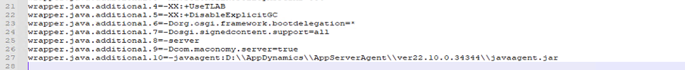
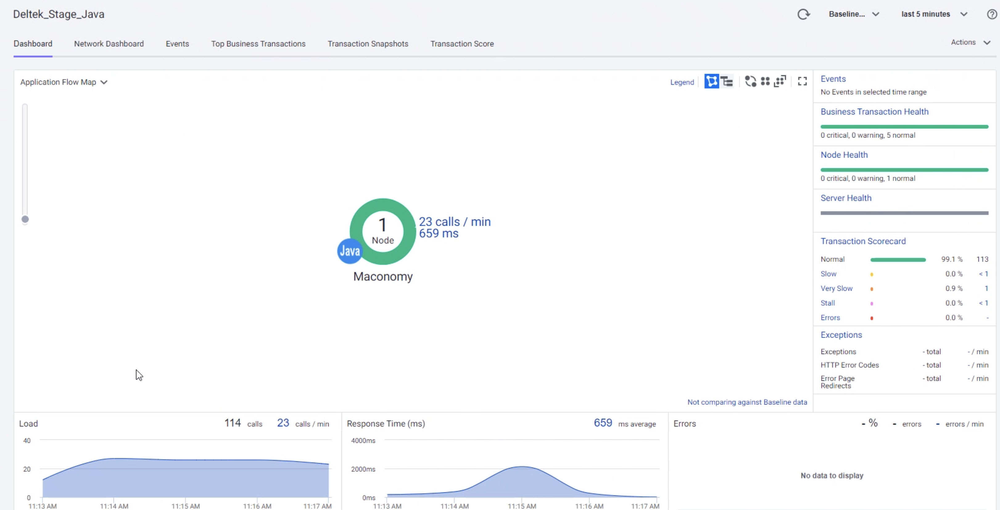
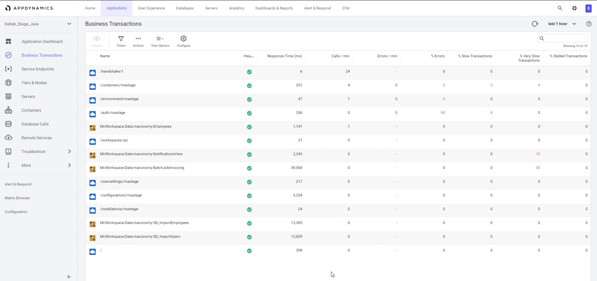
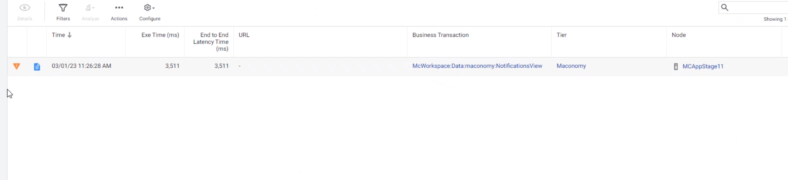
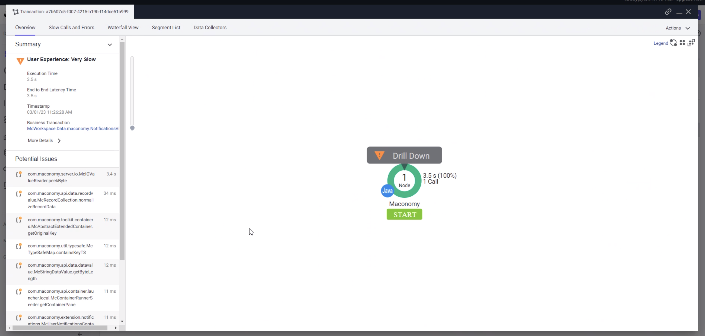

## Deltek Macronomy AppDynamics iSDK Agent Plugin

This plugin is designed to enhance the support for Maconomy when monitoring with AppDynamics

### Installation

The AppDynamics Java agent needs to be installed and the iSDK plugin needs to be installed into the < agent install dir >/ver##*/sdk-plugins directory

In order to instrument the application, the application's wrapper.equinox.conf file needs to have an additional JVM argument added. 

### Application Flowmap

### Business Transactions

The BTs added to the application will resemble these:

### Snapshots

